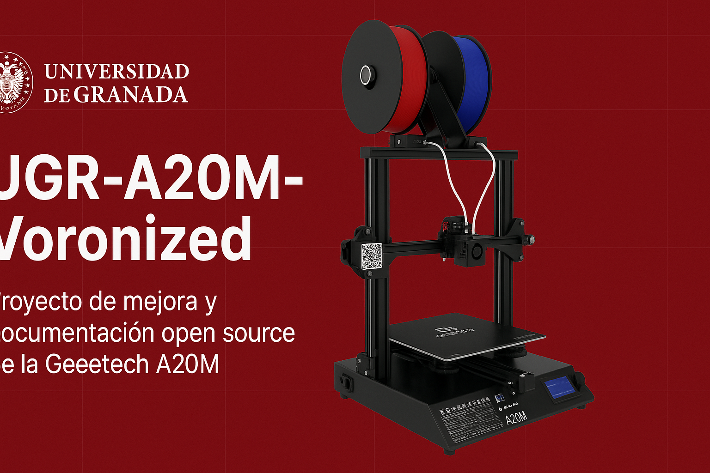

# 🧠 Proyecto UGR-A20M
### Mejora y documentación de una impresora 3D Geeetech A20M

---

## 🧩 Descripción general

Este proyecto tiene como objetivo **modernizar y documentar en detalle** el proceso de mejora de una impresora 3D **Geeetech A20M**, mediante la incorporación de nuevas tecnologías y el rediseño progresivo hacia un sistema **inspirado en la filosofia voron y el proyecto T250** de MSzturc.

El trabajo forma parte de un **proyecto subvencionado por la Universidad de Granada (UGR)**, con fines educativos, divulgativos y de investigación aplicada en el ámbito de la fabricación digital.

---

## 🎯 Objetivos del proyecto

- 🔧 Mejorar el rendimiento, fiabilidad y velocidad de la impresora Geeetech A20M.  
- 🧱 Implementar un **sistema de extrusión directa** de alto caudal (Direct Drive).  
- ⚙️ Adaptar la estructura a un diseño **tipo Voron/T250**, más rígido y modular.  
- 💡 Documentar con detalle cada fase (hardware, firmware y resultados).  
- 🧠 Crear una **guía reproducible y educativa** para estudiantes y makers UGR.  
- 🎨 Personalizar la máquina con estética y elementos visuales de la Universidad de Granada.

---

## 🚀 Fases de desarrollo

| Fase | Descripción | Estado |
|------|--------------|--------|
| 0 | Creación del repositorio y documentación base | ✅ |
| 1 | Sustitución del sistema Bowden por extrusor directo (BMG / Hemera) | 🟡 En progreso |
| 2 | Adaptación estructural con guías lineales y bastidor reforzado | 🔜 |
| 3 | Voronización completa basada en diseño T250 | 🔜 |
| 4 | Informe final y publicación en GitHub Pages / PDF UGR | 🔜 |

---

## ⚙️ Especificaciones iniciales

**Modelo base:** Geeetech A20M  
**Volumen de impresión:** 255 x 255 x 255 mm  
**Sistema original:** Cartesian Bowden  
**Placa base:** [especificar modelo, ej. SKR Mini E3 V2 o GT2560]  
**Firmware:** Marlin 2.1 / Klipper (según fase)  
**Fuente:** 24V DC  
**Cama:** 220V / 24V calefactada  
**Hotend actual:** [por definir — Volcano / Hemera / MicroSwiss]  

---

## 🔧 Mejoras planificadas

### 🧰 Fase 1: Extrusor directo
- Sustitución del sistema Bowden por **Direct Drive BMG o Hemera XS**.  
- Instalación de **hotend Volcano / Revo / Mosquito** para mayor caudal.  
- Actualización de firmware (`E-steps`, retracciones, PID tuning).  
- Documentación de rendimiento (flow, stringing, velocidad).

### 🧱 Fase 2: Voronización ligera
- Sustitución de carros por **guías lineales MGN12H**.  
- Refuerzo del bastidor con perfiles 2020 o 3030.  
- Gestión de cableado tipo Voron.  
- Implementación de iluminación LED y estética UGR.

### ⚡ Fase 3: Conversión completa al sistema T250 (CoreXY)
- Reutilización de componentes de la A20M.  
- Ensamblaje de chasis CoreXY T250.  
- Integración de firmware Klipper y control remoto (Fluidd/Mainsail).  
- Pruebas comparativas frente a la A20M original.

---

## 🧾 Estructura del repositorio

UGR-A20M-Voronized/
├── README.md
├── changelog.md
├── LICENSE
│
├── docs/
│ ├── 00_overview.md
│ ├── 01_geetech_base.md
│ ├── 02_voronization_plan.md
│ ├── 03_t250_integration.md
│ └── img/
│
├── hardware/
│ ├── extrusor-direct-drive/
│ ├── voronization/
│ └── t250-build/
│
├── firmware/
│ ├── marlin/
│ └── klipper/
│
└── photos/

---

## 📸 Documentación

Cada mejora incluirá:
- Fotografías del proceso (antes/después).  
- Archivos STL/STEP y soporte de diseño.  
- Lista de materiales (BOM) y precios.  
- Cambios de firmware y configuraciones.  
- Resultados de pruebas y comparativas.  

---

## 🧠 Créditos y agradecimientos

**Autor principal:** Alvaro Gonzalez Jimenez
**Proyecto apoyado por:** Universidad de Granada (UGR)  
**Inspiración técnica:**  
- Proyecto [T250](https://github.com/MSzturc/T250) de MSzturc  
- Comunidad Voron Design  
- Comunidad maker y grupos de impresión 3D UGR  

---

## 🪙 Licencia

Este proyecto se distribuye bajo licencia **CC BY-SA 4.0**, permitiendo su uso, modificación y redistribución con atribución.  
Consulta el archivo [`LICENSE`](LICENSE) para más detalles.

---

## 🧩 Contacto

📧 **Autor:** alvarogj1@correo.ugr.es

🌐 **Repositorio:** https://github.com/AlvGJ-UGR/UGR-A20M

🏛️ **Universidad de Granada – 2025**

---

> *“La investigación aplicada es el puente entre la curiosidad y la innovación.”*  
> — Proyecto UGR-A20M
