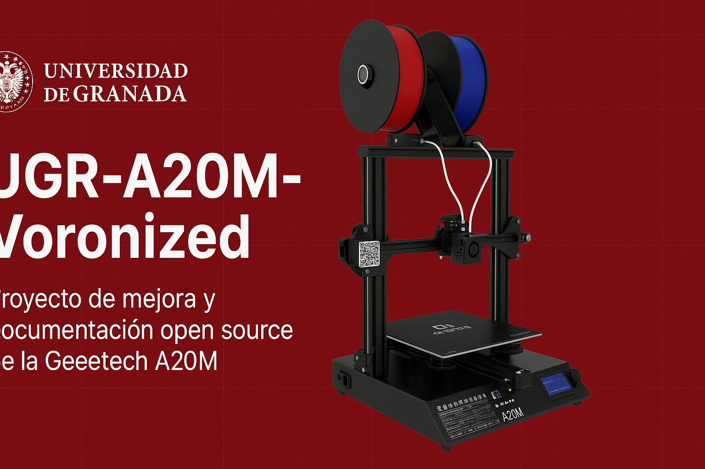

# 🧠 Proyecto UGR-A20M


### Modernización de una impresora 3D Geeetech A20M con electrónica de 32 bits, extrusión directa y firmware Klipper



---

## 🧩 Descripción general

Este proyecto documenta la **modernización progresiva** de una impresora 3D **Geeetech A20M**, incorporando componentes de alto rendimiento: nueva electrónica de 32 bits, extrusor directo tipo Voron (Sharkfin), toolhead Mini Stealth v2 y firmware Klipper.

El proyecto está **apoyado por la Universidad de Granada (UGR)**, con fines educativos, divulgativos y de investigación aplicada en fabricación digital.

---

## 🎯 Objetivos

- 🔧 Mejorar el rendimiento, fiabilidad y calidad de impresión de la Geeetech A20M
- 🖨️ Implementar extrusión directa de alto caudal (Sharkfin + CHC V6 Volcano)
- 🎨 Instalar toolhead estilo Voron: Mini Stealth v2 con refrigeración dual 4010
- ⚙️ Migrar la electrónica a SKR Mini E3 V3 + Orange Pi Zero 3 con Klipper
- 📐 Reforzar la estructura con guías lineales en X e Y
- 📚 Generar una guía reproducible para estudiantes y makers de la UGR

---

## 🚀 Estado del proyecto

| Fase | Descripción | Estado |
|------|-------------|--------|
| **0** | Especificaciones, investigación de componentes y repositorio | ✅ Completada |
| **1a** | Actualización electrónica: SKR Mini E3 V3 + Orange Pi Zero 3 + Klipper | 🟡 En progreso |
| **1b** | Extrusor directo: Sharkfin + BMG Clone + NEMA 17 pancake | 🟡 En progreso |
| **1c** | Toolhead: Mini Stealth v2 + CHC V6 Volcano + CR-Touch | 🟡 En progreso |
| **2** | Guías lineales MGN12H en X e Y + bastidor reforzado | 🔜 Planificada |
| **3** | Benchmarks, comparativas, GitHub Pages e informe UGR | 🔜 Planificada |

---

## ⚙️ Especificaciones

### Máquina base

| Parámetro | Valor |
|-----------|-------|
| **Modelo** | Geeetech A20M |
| **Volumen de impresión** | 255 × 255 × 255 mm |
| **Cinemática** | Cartesiana (Bowden) |
| **Placa original** | GT2560 v3 (ATmega2560, 8-bit) |
| **Firmware original** | Marlin 1.x |
| **Alimentación** | 24V DC |

### Configuración objetivo (tras Fase 1)

| Subsistema | Componente |
|------------|-----------|
| **Placa** | BTT SKR Mini E3 V3.0 (STM32G0B1, 32-bit) |
| **SBC** | Orange Pi Zero 3 — 1 GB RAM |
| **Firmware** | Klipper + Moonraker + Fluidd |
| **Extrusor** | Sharkfin + BMG Clone (direct drive, ~3.5:1) |
| **Hotend** | CHC V6 Volcano (alto caudal, 24V) |
| **Toolhead** | Mini Stealth v2 (shroud estilo Voron) |
| **Refrigeración capa** | 2× ventilador 4010 24V (radial, dual simétrico) |
| **Refrigeración hotend** | 1× ventilador 2510 24V |
| **Nivelación** | CR-Touch (autonivelado mesh) |

---

## 🗂️ Estructura del repositorio

```
UGR-A20M/
│
├── README.md                        ← Este archivo
├── CHANGELOG.md                     ← Historial de cambios por versión
├── CONTRIBUTING.md                  ← Cómo contribuir al proyecto
├── LICENSE                          ← CC BY-SA 4.0
├── .gitignore
│
├── docs/
│   ├── guia_calibracion.md          ← Calibración completa paso a paso ⭐
│   ├── fase-0/
│   │   └── 00_especificaciones_base.md      ← Specs Geeetech A20M original
│   ├── fase-1/
│   │   ├── electronica/
│   │   │   └── 01_skr_klipper.md            ← Instalación SKR + Klipper en OPi
│   │   ├── extrusor/
│   │   │   └── 02_sharkfin_bmg.md           ← Montaje y calibración Sharkfin
│   │   └── toolhead/
│   │       └── 03_mini_stealth_chc_crtouch.md ← Mini Stealth + Volcano + CR-Touch
│   ├── fase-2/
│   │   └── 04_guias_lineales.md             ← Guías MGN12H en X e Y
│   ├── fase-3/
│   │   └── 05_documentacion_final.md        ← Benchmarks, GitHub Pages e informe
│   └── img/
│       └── banner-ugr-a20m.png
│
├── hardware/
│   ├── bom/
│   │   └── BOM_fase1.md             ← Lista de materiales con precios y links
│   ├── prints/
│   │   └── README.md                ← Registro de piezas impresas
│   └── electronica/
│       └── esquema_conexiones.md    ← Conexiones SKR Mini E3 V3 completas
│
├── firmware/
│   ├── klipper/
│   │   ├── config/
│   │   │   └── printer.cfg          ← Configuración Klipper para A20M
│   │   └── macros/
│   │       └── macros.cfg           ← Macros: START_PRINT, LOAD, PID, PA...
│   └── marlin/                      ← Configuración Marlin (referencia)
│
└── photos/
    ├── README.md                    ← Convención de nombres y checklist
    ├── estado-inicial/              ← Fotos antes de modificaciones
    ├── fase-1/                      ← Fotos del proceso fase 1
    └── fase-2/                      ← Fotos del proceso fase 2
```

---

## 📦 Bill of Materials — Resumen Fase 1

> Documento completo con tornillería y STLs: [`hardware/bom/BOM_fase1.md`](hardware/bom/BOM_fase1.md)

| Componente | Enlace | Precio aprox. |
|------------|--------|--------------|
| BTT SKR Mini E3 V3.0 | [AliExpress](https://es.aliexpress.com/item/1005007912548824.html) | ~25 € |
| Orange Pi Zero 3 (1 GB) | [AliExpress](https://es.aliexpress.com/item/1005006047845950.html) | ~25 € |
| MicroSD SanDisk 32 GB | [Amazon ES](https://www.amazon.es/SanDisk-Tarjeta-microSDXC-Adaptador-Rendimiento/dp/B0B7NXBM6P) | ~8 € |
| Motor NEMA 17 pancake 20mm | [AliExpress](https://es.aliexpress.com/item/1005005933469472.html) | ~5 € |
| BMG Clone (engranajes) | [AliExpress](https://es.aliexpress.com/item/1005003423850142.html) | ~5 € |
| Hotend CHC V6 Volcano | [AliExpress](https://es.aliexpress.com/item/1005003849153931.html) | ~12 € |
| Ventiladores 4010 24V ×2 | [AliExpress](https://es.aliexpress.com/item/1005003371996395.html) | ~3 € |
| Ventilador 2510 24V ×1 | [AliExpress](https://es.aliexpress.com/item/1005006831848917.html) | ~5 € |
| CR-Touch (autonivelador) | [AliExpress](https://es.aliexpress.com/item/1005009035812836.html) | ~12 € |
| Insertos M3 ×5 | [AliExpress](https://es.aliexpress.com/item/1005008285787978.html) | ~1 € |
| Tornillería variada M3/M2.5 | [AliExpress](https://es.aliexpress.com/item/4000026671295.html) | ~3 € |
| Extensores JST ventiladores | [AliExpress](https://es.aliexpress.com/item/1005005491577017.html) | ~2 € |
| **Sharkfin Extruder (STL)** | [GitHub KayosMaker](https://github.com/KayosMaker/Sharkfin_Extruder) | Gratis |
| **Mini Stealth v2 (STL)** | [GitHub atrushing](https://github.com/atrushing/Mini_Stealth) | Gratis |
| **TOTAL FASE 1** | | **~106 €** |

---

## 📚 Documentación rápida

| Documento | Descripción |
|-----------|-------------|
| [🎯 Guía de calibración](docs/guia_calibracion.md) | Calibración completa paso a paso — empezar aquí tras instalar |
| [🖨️ Configuración del slicer](docs/slicer_settings.md) | Perfiles PLA / ABS / PETG / TPU con start G-code |
| [⚡ Esquema de conexiones](hardware/electronica/esquema_conexiones.md) | Conexionado completo SKR Mini E3 V3 |
| [⚙️ Firmware — instalación y macros](firmware/README.md) | Cómo instalar printer.cfg y referencia de macros |
| [📦 BOM Fase 1](hardware/bom/BOM_fase1.md) | Lista de materiales con precios y enlaces |
| [🖨️ Registro de impresiones](hardware/prints/README.md) | Seguimiento de piezas impresas |
| [🤝 Contribuir](CONTRIBUTING.md) | Cómo proponer mejoras al proyecto |

---

## 🔗 Referencias

### Hardware
- [Sharkfin Extruder — KayosMaker](https://github.com/KayosMaker/Sharkfin_Extruder)
- [Mini Stealth v2 — atrushing](https://github.com/atrushing/Mini_Stealth)
- [Adaptador Bambu hotend → V6 (Cults3D)](https://cults3d.com/es/modelo-3d/herramientas/bambu-lab-s-hotend-adapter-to-v6-size)

### Firmware
- [Klipper — klipper3d.org](https://www.klipper3d.org/)
- [Moonraker — moonraker.readthedocs.io](https://moonraker.readthedocs.io/)
- [Fluidd — fluidd.xyz](https://fluidd.xyz/)
- [KIAUH — instalador Klipper](https://github.com/dw-0/kiauh)

### Electrónica
- [BTT SKR Mini E3 V3 — GitHub BigTreeTech](https://github.com/bigtreetech/BIGTREETECH-SKR-mini-E3)
- [Orange Pi Zero 3 — orangepi.org](http://www.orangepi.org/html/hardWare/computerAndMicrocontrollers/details/Orange-Pi-Zero-3.html)
- [Armbian para Orange Pi Zero 3](https://www.armbian.com/orange-pi-zero3/)

---

## 👤 Créditos

**Autor:** Álvaro González Jiménez — `alvarogj1@correo.ugr.es`  
**Institución:** Universidad de Granada (UGR) — 2025  

Inspiración técnica: comunidad [Voron Design](https://vorondesign.com/), [KayosMaker](https://github.com/KayosMaker) y [atrushing](https://github.com/atrushing).

---

## 📄 Licencia

Distribuido bajo licencia **[CC BY-SA 4.0](LICENSE)** — libre uso con atribución y misma licencia.
